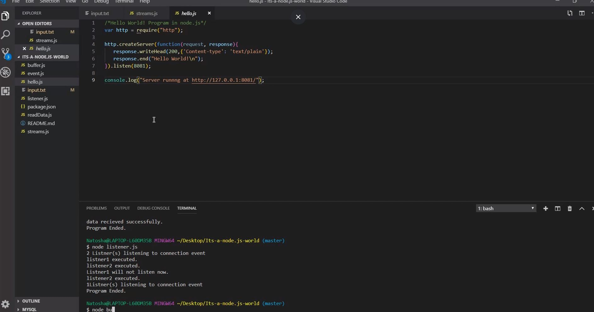

# Its-a-node.js-world

Running through the node.js basics. Learned alot about node buffer through this tutorial. Buffer is a core feature in node.js that makes it possible to manipulate or interact with streams of binary data. Here is an article that goes into further detail. https://medium.freecodecamp.org/do-you-want-a-better-understanding-of-buffer-in-node-js-check-this-out-2e29de2968e8  

# Why? 

Because node.js is awesome! Node.js is a fast and scalable server side application that enables event-driven applications. 

# Installation 

https://www.guru99.com/download-install-node-js.html

# Usage

https://nodejs.org/en/docs/

# Credit

https://www.tutorialspoint.com/nodejs/nodejs_environment_setup.htm